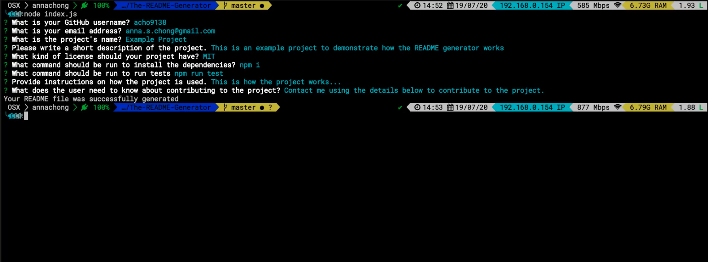

# The README Generator


## Description

A CLI app which generates a README file using the inputs entered by the user.

## Table of Contents

* [Installation](#installation)
* [Usage](#usage)
* [License](#license)
* [Contributing](#contributing)
* [Tests](#tests)
* [Questions](#questions)

## Installation

To install the necessary dependencies, run the following command:

```
npm i
```

## Usage

Run the following code in the Terminal or Git Bash:
```
node index.js
```
Then answer the questions to generate a README file with the entered content. Click [this link](https://drive.google.com/file/d/1akuutw_mXOI27QDjWHB03wjidchYrdM8/view) to watch a video to see how the README generator works.



## License

This project is licensed under the MIT license.

## Questions

If you have any questions about the repo, open an issue or want to discuss, contact me directly at anna.s.chong@gmail.com. You can find more of my work at [acho9138](https://github.com/acho9138/.).

## Credits

Thank you to the following resources to help make this day planner possible:

- The Coding Bootcamp at University of Sydney
- MDN
- Stack Overflow
- Node.js
- NPM
- [License badge](https://shields.io/category/license)
- [ReadMe formatting and syntax](https://docs.github.com/en/github/writing-on-github/basic-writing-and-formatting-syntax)